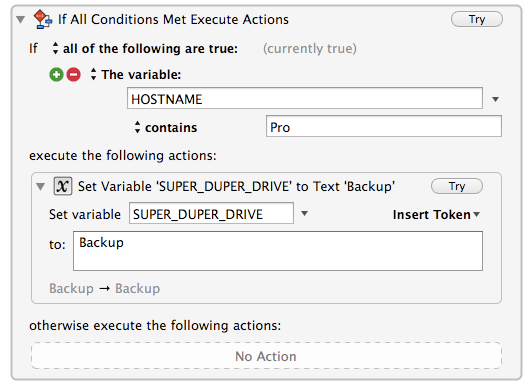

km-superduper-launch
====================

Use Keyboard Maestro to mount SuperDuper’s drive when SuperDuper launches.

The idea is fairly simple: [SuperDuper] will only work if there is a drive mounted to backup _to_, but keeping your backup drive mounted all the time will lead to frustrations (Spotlight finding files on the backup drive, apps launching from the backup drive instead of the main drive, etc).

So the logical choice is to keep the drive unmounted, and have it mount automatically when SuperDuper launches.

Since Keyboard Maestro can sync its macros, you might use it on several different Macs, and they might each have a different backup drive name.

To handle this, at the beginning of the macro are a number of “If Then Else” conditions. Here is one example: for my MacBook Pro with the hostname “Pro” the SuperDuper backup drive is named “Backup” (yes, I know neither name is very creative). Here is what that looks like in Keyboard Maestro:

You can copy and paste that condition for each Mac that you use, and fill in the “Hostname contains” and the “Set SUPER_DUPER_DRIVER to” variables.

When SuperDuper launches, the Keyboard Maestro macro will run, check to see if the drive is mounted, _attempt_ to mount it if it isn't, and then  try to trigger a backup in SuperDuper.

This is far from foolproof. I have reworked it a number of times, and this _appears_ to work for me, but I wouldn’t be surprised to find that it didn’t work for others. Still, it should hopefully give you enough of a starting point.

### Installation ###

[Download the zip file][] of the repository. Unzip it, double-click on the .kmmacros file inside, which will launch Keyboard Maestro (if necessary) and import the macro. (You can, of course, also import it using the **File » Import Macros...** menu in Keyboard Maestro.)

[Download the zip file]: https://github.com/tjluoma/km-superduper-launch/archive/master.zip

[SuperDuper]: http://www.shirt-pocket.com/superduper/